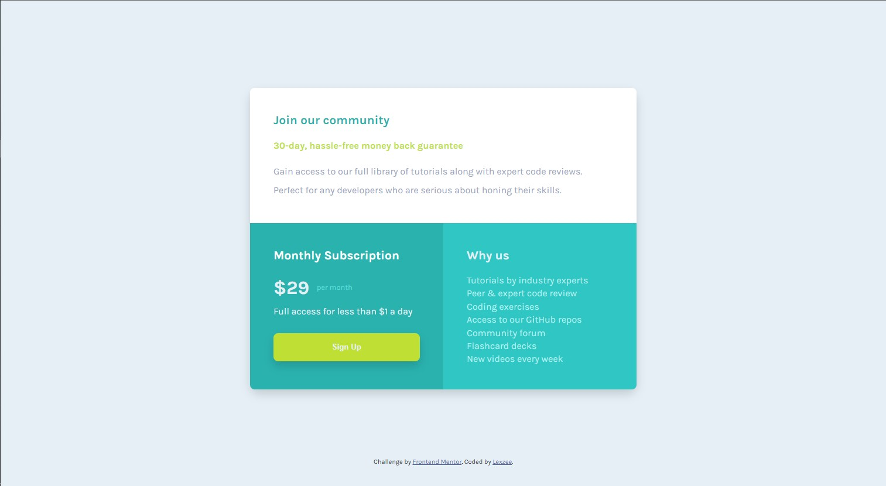

# Frontend Mentor - Single price grid component solution

This is a solution to the [Single price grid component challenge on Frontend Mentor](https://www.frontendmentor.io/challenges/single-price-grid-component-5ce41129d0ff452fec5abbbc). Frontend Mentor challenges help you improve your coding skills by building realistic projects.

## Table of contents

- [Overview](#overview)
  - [The challenge](#the-challenge)
  - [Screenshot](#screenshot)
  - [Links](#links)
- [My process](#my-process)
  - [Built with](#built-with)
  - [What I learned](#what-i-learned)
  - [Continued development](#continued-development)
- [Author](#author)

## Overview

### The challenge

Users should be able to:

- View the optimal layout for the component depending on their device's screen size
- See a hover state on desktop for the Sign Up call-to-action

### Screenshot



### Links

- Solution URL: [Check](https://www.frontendmentor.io/solutions/single-price-grid-component-using-sass-react-js-G0lAoYakPJ)
- Live Site URL: [Visit](https://single-price-grid)

## My process

### Built with

- Semantic HTML5 markup
- SASS/SCSS
- Flexbox
- CSS Grid
- Mobile-first workflow
- [React](https://reactjs.org/) - JS library
- [Next.js](https://nextjs.org/) - React framework


### What I learned

I learned how to use sass/scss that allows for more functionalities outside the scope of vanilla CSS.

```scss
@import 'some_branch'
lighten($hue, 10%)
@mixin somefunc(){
  //some codes
}
@include somefun
```

If you want more help with writing markdown, we'd recommend checking out [The Markdown Guide](https://www.markdownguide.org/) to learn more.

### Continued development

I will continue working with sass/scss in order to build familiarity and of course to level up in general.


## Author

- Website - [Abdulquddus Abdulrahman (Lexzee)](https://www.github.com/lexzee)
- Frontend Mentor - [@lexzee](https://www.frontendmentor.io/profile/lexzee)
- Twitter - [@devlexzee](https://www.twitter.com/devlexzee)


